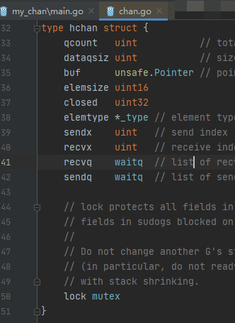
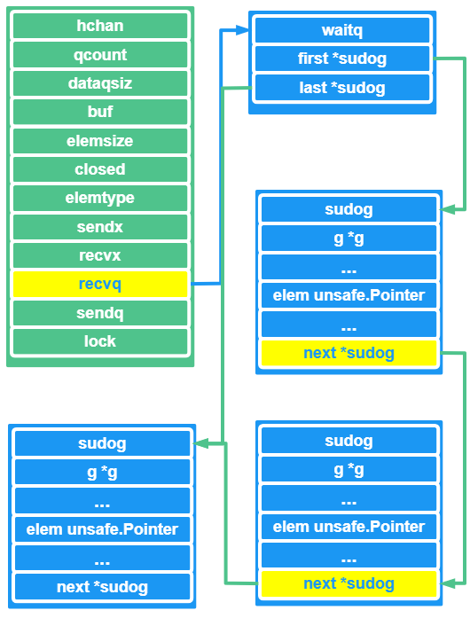
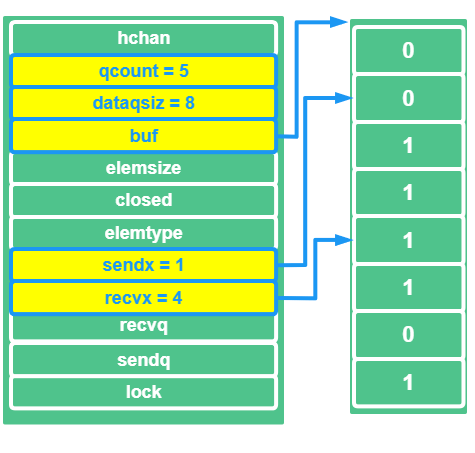
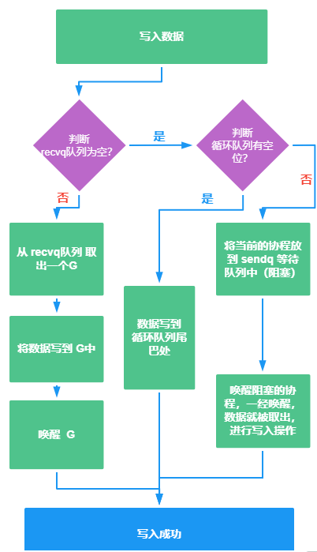
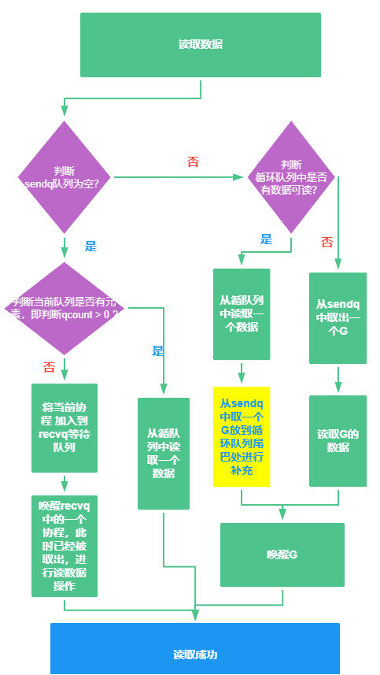

# GO 中 Chan 实现原理分享

## chan 是什么？

是一种特殊的类型，是连接并发`goroutine`的管道

channel 通道是可以让一个 goroutine 协程发送特定值到另一个 goroutine 协程的**通信机制**。

**通道**像一个传送带或者队列，总是遵循**先入先出**（First In First Out）的规则，保证收发数据的顺序，这一点和**管道**是一样的

一个协程从通道的一头放入数据，另一个协程从通道的另一头读出数据

每一个通道都是一个具体类型的导管，声明 channel 的时候需要为其指定元素类型。


本篇文章主要是分享关于通道的实现原理，关于通道的使用，可以查看文章  [GO通道和 sync 包的分享](https://juejin.cn/post/6973108979777929230) ，这里有详细的说明

## GO 中 Chan 的底层数据结构

了解每一个组件或者每一个数据类型的实现原理，咱们都会去看源码中的数据结构是如何设计的

同样，我们一起来看看 GO 的 Chan 的数据结构

GO 的 Chan 的源码实现是在 ： `src/runtime/chan.go`



```go
type hchan struct {
   qcount   uint           // total data in the queue
   dataqsiz uint           // size of the circular queue
   buf      unsafe.Pointer // points to an array of dataqsiz elements
   elemsize uint16
   closed   uint32
   elemtype *_type // element type
   sendx    uint   // send index
   recvx    uint   // receive index
   recvq    waitq  // list of recv waiters
   sendq    waitq  // list of send waiters

   // lock protects all fields in hchan, as well as several
   // fields in sudogs blocked on this channel.
   //
   // Do not change another G's status while holding this lock
   // (in particular, do not ready a G), as this can deadlock
   // with stack shrinking.
   lock mutex
}
```

`hchan` 是实现通道的核心数据结构，对应的成员也是不少，咱们根据源码注释一个参数一个参数的来看看


| tag      | 说明                                                       |
| -------- | ---------------------------------------------------------- |
| qcount   | 当前的队列，剩余元素个数                                   |
| dataqsiz | 环形队列可以存放的元素个数，也就是环形队列的长度           |
| buf      | 指针，指向环形队列                                         |
| elemsize | 指的的队列中每个元素的大小                                 |
| closed   | 具体标识关闭的状态                                         |
| elemtype | 见名知意，元素的类型                                       |
| sendx    | 发送队列的下标，向队列中写入数据的时候，存放在队列中的位置 |
| recvx    | 接受队列的下标，从队列的 这个位置开始读取数据              |
| recvq    | 协程队列，等待读取消息的协程队列                           |
| sendq    | 协程队列，等待发送消息的协程队列                           |
| lock     | 互斥锁，在 chan 中，不可以并发的读写数据                   |

根据上面的参数，我们或多或少就可以知道 GO 中的通道实现原理设计了哪些知识点：

- 指针
- 环形队列
- 协程
- 互斥锁

我们顺便再来看看上述成员的协程队列  `waitq` 对应的是啥样的数据结构

```go
type waitq struct {
   first *sudog
   last  *sudog
}
```

`sudog` 结构是在 `src/runtime/runtime2.go`中 ，咱们顺便多学一手

```go
// sudog represents a g in a wait list, such as for sending/receiving
// on a channel.
type sudog struct {
   // The following fields are protected by the hchan.lock of the
   // channel this sudog is blocking on. shrinkstack depends on
   // this for sudogs involved in channel ops.

   g *g

   next *sudog
   prev *sudog
   elem unsafe.Pointer // data element (may point to stack)

   // The following fields are never accessed concurrently.
   // For channels, waitlink is only accessed by g.
   // For semaphores, all fields (including the ones above)
   // are only accessed when holding a semaRoot lock.

   acquiretime int64
   releasetime int64
   ticket      uint32

   // isSelect indicates g is participating in a select, so
   // g.selectDone must be CAS'd to win the wake-up race.
   isSelect bool

   // success indicates whether communication over channel c
   // succeeded. It is true if the goroutine was awoken because a
   // value was delivered over channel c, and false if awoken
   // because c was closed.
   success bool

   parent   *sudog // semaRoot binary tree
   waitlink *sudog // g.waiting list or semaRoot
   waittail *sudog // semaRoot
   c        *hchan // channel
}
```

根据源码注释，咱们大致知道`sudog` 是干啥的

`Sudog`表示等待列表中的 g，例如在一个通道上发送/接收

`Sudog`是很必要的，因为g↔synchronization对象关系是多对多

一个 g 可能在很多等候队列上，所以一个 g 可能有很多`sudogs`

而且许多 g 可能在等待同一个同步对象，所以一个对象可能有许多`sudogs`

**咱们抓住主要矛盾**

`Sudog`的数据结构，主要的东西就是一个 `g` 和一个 `elem` ，

**g**，上面有说到他和 `Sudog`的对应关系

无论是读通道还是写通道，都会需要 **elem**

- 读通道

数据会从`hchan`的队列中，拷贝到`sudog`的`elem`中

- 写通道

与读通道类似，是将数据从 `sudog` 的`elem`处拷贝到`hchan`的队列中

## 咱们来画个图看看



此处咱们画一个 `hchan`的结构，主要画一下 `recvq`等待读取消息的协程队列，此处的队列，实际上就是用链表来实现的

`recvq`会对应到 `waitq`结构，`waitq` 分为`first`头结点  和 `last`尾节点 结构分别是 `sudog`

`sudog`里面 elem存放具体的数据，next 指针指向下一个 `sudog`，直到指到`last` 的 `sudog`

通过上述的，应该就能明白 GO 中的 `chan` 基本结构了吧


咱来再来详细看看  `hchan` 中其他参数都具体是啥意思

- `dataqsiz`  对应的环形队列是啥样的
- 写 `sendq`和 读 `recvq` 等待队列是啥样的
- `elemtype`元素类型信息又是啥

### `dataqsiz`  对应的环形队列是啥样的

环形队列，故名思议就是 一个首尾连接，成环状的队列

GO 中的 `chan`内部的环形队列，主要作用是作为缓冲区

这个环形队列的长度，我们在创建队列的时候， 也就是创建 `hchan` 结构的时候，就已经指定好了的

就是 `dataqsiz` ，环形队列的长度

**咱们画个图清醒一下**



上图需要表达的意思是这个样子的，**上述的队列是循环队列，默认首尾连接哦**：

- **dataqsiz**  表示 循环队列的长度是 8 个
- **qcount** 表示 当前队列中有 5 个元素
- **buf** 是指针，指向循环队列头
- **sendx** 是发送队列的下标，这里为 1 ，则指向队列的第 2 个区域 ，这个参数可选范围是 **[0 , 8)**
- **recvx** 是接收队列的下标，这里为 4 ，则指向的是 队列的第 5 个区域进行读取数据

这里顺带提一下，`hchan` 中读取数据还是写入数据，都是需要去拿 `lock` 互斥锁的，同一个通道，在同一个时刻只能允许一个协程进行读写


### 写 `sendq`和 读 `recvq` 等待队列是啥样的

`hchan` 结构中的  2 个协程队列，一个是用于读取数据，一个是用于发送数据，他们都是等待队列，我们来看看这个等待队列都是咋放数据上去的，分别有啥特性需要注意

**当从通道中读取 或者 发送数据：**

- 若通道的缓冲区为空，或者没有缓冲区，此时从通道中读取数据，则协程是会**被阻塞**的
- 若通道缓冲区为满，或者没有缓冲区，此时从通道中写数据，则协程仍然也会**被阻塞**

这些被阻塞的协程就会被放到等待队列中，按照读 和 写 的动作来进行分类为写 `sendq`和 读 `recvq` 队列

**那么这些阻塞的协程，啥时候会被唤醒呢？**


看过之前的文章 [GO通道和 sync 包的分享](https://juejin.cn/post/6973108979777929230)，应该就能知道

我们在来回顾一下，这篇文章的表格，通道会存在的异常情况：

| channel 状态 | 未初始化的通道（nil） | 通道非空                                         | 通道是空的                     | 通道满了                                         | 通道未满                                         |
| ------------ | --------------------- | ------------------------------------------------ | ------------------------------ | ------------------------------------------------ | ------------------------------------------------ |
| 接收数据     | `阻塞`                | 接收数据                                         | `阻塞`                         | 接收数据                                         | 接收数据                                         |
| 发送数据     | `阻塞`                | 发送数据                                         | 发送数据                       | `阻塞`                                           | 发送数据                                         |
| 关闭         | **panic**             | 关闭通道成功<br />待数据读取完毕后<br />返回零值 | 关闭通道成功<br />直接返回零值 | 关闭通道成功<br />待数据读取完毕后<br />返回零值 | 关闭通道成功<br />待数据读取完毕后<br />返回零值 |

此时，我们就知道，具体什么时候被阻塞的协程会被唤醒了

- 因为读阻塞的协程，会被通道中的写入数据的协程唤醒，反之亦然

- 因为写阻塞的协程，也会被通道中读取数据的协程唤醒

### `elemtype`元素类型信息又是啥

这个元素类型信息就不难理解了，对于我们使用通道，创建通道的时候我们需要填入通道中数据的类型，一个通道，只能写一种数据类型，指的就是这里的`elemtype`

另外 `hchan` 还有一个成员是`elemsize`，代表上述元素类型的占用空间大小

**那么这俩成员有啥作用呢？**

`elemtype`和`elemsize`就可以计算指定类型的数据占用空间大小了

前者用于在数据传递的过程中进行赋值

后者可以用来在环形队列中定位具体的元素

## 创建 chan 是咋实现的？

我们再来瞅瞅 `chan.go` 的源码实现 ，看到源码中的 `makechan` 具体实现

```go
func makechan(t *chantype, size int) *hchan {
   elem := t.elem

   // compiler checks this but be safe.
   if elem.size >= 1<<16 {
      throw("makechan: invalid channel element type")
   }
   if hchanSize%maxAlign != 0 || elem.align > maxAlign {
      throw("makechan: bad alignment")
   }

   mem, overflow := math.MulUintptr(elem.size, uintptr(size))
   if overflow || mem > maxAlloc-hchanSize || size < 0 {
      panic(plainError("makechan: size out of range"))
   }

   // Hchan does not contain pointers interesting for GC when elements stored in buf do not contain pointers.
   // buf points into the same allocation, elemtype is persistent.
   // SudoG's are referenced from their owning thread so they can't be collected.
   // TODO(dvyukov,rlh): Rethink when collector can move allocated objects.
   var c *hchan
   switch {
   case mem == 0:
      // Queue or element size is zero.
      c = (*hchan)(mallocgc(hchanSize, nil, true))
      // Race detector uses this location for synchronization.
      c.buf = c.raceaddr()
   case elem.ptrdata == 0:
      // Elements do not contain pointers.
      // Allocate hchan and buf in one call.
      c = (*hchan)(mallocgc(hchanSize+mem, nil, true))
      c.buf = add(unsafe.Pointer(c), hchanSize)
   default:
      // Elements contain pointers.
      c = new(hchan)
      c.buf = mallocgc(mem, elem, true)
   }

   c.elemsize = uint16(elem.size)
   c.elemtype = elem
   c.dataqsiz = uint(size)
   lockInit(&c.lock, lockRankHchan)

   if debugChan {
      print("makechan: chan=", c, "; elemsize=", elem.size, "; dataqsiz=", size, "\n")
   }
   return c
}
```

如上源码实际上就是初始化 `chan` 对应的成员，**其中循环队列 buf 的大小，是由 `makechan` 函数传入的 类型信息和缓冲区长度决定的**，也就是`makechan` 的入参

可以通过上述代码的 **3** 个位置就可以知道

```go
// 1
func makechan(t *chantype, size int) *hchan
// 2
mem, overflow := math.MulUintptr(elem.size, uintptr(size))
// 3
var c *hchan
   switch {
   case mem == 0:
      // Queue or element size is zero.
      c = (*hchan)(mallocgc(hchanSize, nil, true))
      // Race detector uses this location for synchronization.
      c.buf = c.raceaddr()
   case elem.ptrdata == 0:
      // Elements do not contain pointers.
      // Allocate hchan and buf in one call.
      c = (*hchan)(mallocgc(hchanSize+mem, nil, true))
      c.buf = add(unsafe.Pointer(c), hchanSize)
   default:
      // Elements contain pointers.
      c = new(hchan)
      c.buf = mallocgc(mem, elem, true)
   }
```


## 读写 chan 的基本流程

第一张图说明白**向 chan 写入数据的流程**



向通道中写入数据，我们会涉及`sendq`  、 `recvq`队列，和循环队列的资源问题

根据图示可以看出向通道中写入数据分为 **3 种**情况：

- 写入数据的时候，若`recvq` 队列为空，且循环队列有空位，那么就直接将数据写入到 循环队列的队尾 即可
- 若`recvq` 队列为空，且循环队列无空位，则将当前的协程放到`sendq`等待队列中进行阻塞，等待被唤醒，当被唤醒的时候，需要写入的数据，已经被读取出来，且已经完成了写入操作
- 若`recvq` 队列为不为空，那么可以说明循环队列中没有数据，或者循环队列是空的，即没有缓冲区（**向无缓冲的通道写入数据**），此时，直接将`recvq`等待队列中取出一个G，写入数据，唤醒G，完成写入操作

第二张图说明白**向 chan 读取数据的流程**



向通道中读取数据，我们会涉及`sendq`  、 `recvq`队列，和循环队列的资源问题

根据图示可以看出向通道中读取数据分为 **4 种**情况：

- 若`sendq`为空，且循环队列无元素的时候，那就将当前的协程加入`recvq`等待队列，把`recvq`等待队列对头的一个协程取出来，唤醒，读取数据
- 若`sendq`为空，且循环队列有元素的时候，直接读取循环队列中的数据即可
- 若`sendq`有数据，且循环队列有元素的时候，直接读取循环队列中的数据即可，且把`sendq`队列取一个G放到循环队列中，进行补充
- 若`sendq`有数据，且循环队列无元素的时候，则从`sendq`取出一个G，并且唤醒他，进行数据读取操作

**上面说了通道的创建，读写，那么通道咋关闭？**


通道的关闭，我们在应用的时候直接 `close` 就搞定了，那么对应`close`的时候，底层的队列都是做了啥呢？

若关闭了当前的通道，那么系统会把`recvq` 读取数据的等待队列里面的所有协程，全部唤醒，这里面的每一个G 写入的数据 默认就写个 nil，因为通道关闭了，从关闭的通道里面读取数据，读到的是nil

系统还会把`sendq`写数据的等待队列里面的每一个协程唤醒，但是此时就会有问题了，向已经关闭的协程里面写入数据，会报`panic`

我们再来梳理一下，什么情况下对通道操作，会报`panic`，咱们现在对之前提到的表格再来补充一波


| channel 状态 | 未初始化的通道（nil） | 通道非空                                         | 通道是空的                     | 通道满了                                         | 通道未满                                         | 关闭的通道 |
| ------------ | --------------------- | ------------------------------------------------ | ------------------------------ | ------------------------------------------------ | ------------------------------------------------ | ---------- |
| 接收数据     | `阻塞`                | 接收数据                                         | `阻塞`                         | 接收数据                                         | 接收数据                                         | `nil`      |
| 发送数据     | `阻塞`                | 发送数据                                         | 发送数据                       | `阻塞`                                           | 发送数据                                         | **panic**  |
| 关闭         | **panic**             | 关闭通道成功<br />待数据读取完毕后<br />返回零值 | 关闭通道成功<br />直接返回零值 | 关闭通道成功<br />待数据读取完毕后<br />返回零值 | 关闭通道成功<br />待数据读取完毕后<br />返回零值 | **panic**  |

- 关闭一个已经被关闭了的通道，会报`panic`
- 关闭一个未初始化的通道，即为`nil`的通道，也会报`panic`
- 向一个已经关闭的通道写入数据，会报`panic`

**你以为这就完了吗？**


GO 里面`Chan` 一般会和 `select` 搭配使用，我们最后来简单说一下**GO 的 通道咋和select使用**吧

GO 里面`select` 就和 `C/C++`里面的`多路IO复用`类似，在`C/C++`中多路IO复用有如下几种方式

- SELECT
- POLL
- EPOLL

都可以自己去模拟实现多路IO复用，各有利弊，一般使用的最多的是 EPOLL，且C/C++也有对应的网络库

当我们写GO 的多路IO复用的时候，那就相当爽了，GO 默认支持`select` 关键字


## SELECT 简单使用

我们就来看看都是咋用的，不废话，咱直接上DEMO

```go
package main

import (
   "log"
   "time"
)

func main() {

   // 简单设置log参数
   log.SetFlags(log.Lshortfile | log.LstdFlags)

   // 创建 2 个通道，元素数据类型为 int，缓冲区大小为 5
   var ch1 = make(chan int, 5)
   var ch2 = make(chan int, 5)

   // 分别向通道中各自写入数据，咱默认写1吧
   // 直接写一个匿名函数 向通道中添加数据
   go func (){
      var num = 1
      for {
         ch1 <- num
         num += 1
         time.Sleep(1 * time.Second)
      }
   }()

   go func (){
      var num = 1
      for {
         ch2 <- num
         num += 1
         time.Sleep(1 * time.Second)
      }
   }()

   for {
      select {// 读取数据
      case num := <-ch1:
         log.Printf("read ch1 data is  %d\n", num)

      case num := <-ch2:
         log.Printf("read ch2 data is: %d\n", num)

      default:
         log.Printf("ch1 and ch2 is empty\n")
          // 休息 1s 再读
         time.Sleep(1 * time.Second)
      }
   }
}
```

运行效果

```shell
2021/06/18 17:43:06 main.go:54: ch1 and ch2 is empty
2021/06/18 17:43:07 main.go:48: read ch1 data is  1
2021/06/18 17:43:07 main.go:48: read ch1 data is  2
2021/06/18 17:43:07 main.go:51: read ch2 data is: 1
2021/06/18 17:43:07 main.go:51: read ch2 data is: 2
2021/06/18 17:43:07 main.go:54: ch1 and ch2 is empty
2021/06/18 17:43:08 main.go:48: read ch1 data is  3
2021/06/18 17:43:08 main.go:51: read ch2 data is: 3
2021/06/18 17:43:08 main.go:54: ch1 and ch2 is empty
2021/06/18 17:43:09 main.go:48: read ch1 data is  4
2021/06/18 17:43:09 main.go:51: read ch2 data is: 4
2021/06/18 17:43:09 main.go:54: ch1 and ch2 is empty
2021/06/18 17:43:10 main.go:51: read ch2 data is: 5
2021/06/18 17:43:10 main.go:48: read ch1 data is  5
```

从运行结果来看，`select` 监控的 2个 通道，读取到的数据是随机的

可是我们看到`case`这个关键字，是不是会想到 `switch ... case...`，此处的的`case` 是顺序运行的（**GO 中没有switch**），`select` 里面的 `case` 应该也是顺序运行才对呀，为啥结果是随机的?


大家要是感兴趣的话，可以深入研究一下，咱们今天就先到这里了。

## 总结

- 分享了 GO 中通道是什么
- 通道的底层数据结构详细解析
- 通道在GO源码中是如何实现的
- Chan 读写的基本原理
- 关闭通道会出现哪些异常，**panic**
- select 的简单应用

---

> 作者：小魔童哪吒
> 链接：https://learnku.com/articles/58273#f7adf0
> 来源：learnku
> 著作权归作者所有。商业转载请联系作者获得授权，非商业转载请注明出处。


