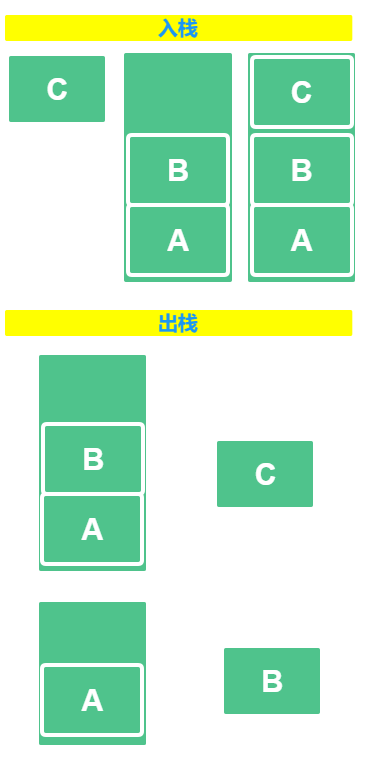
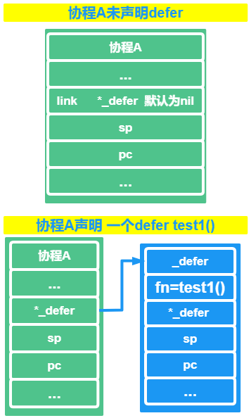
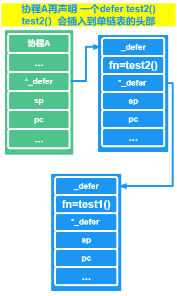
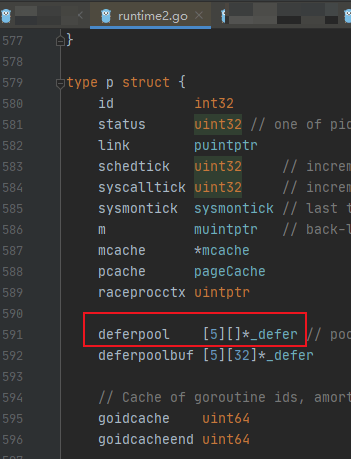

# GO 中 defer的实现原理

## defer 是什么？

咱们一起来看看 `defer` 是个啥

**是 GO 中的一个关键字**

这个关键字，我们一般用在释放资源，在 `return` 前会调用他

如果程序中有多个 `defer` ，defer 的调用顺序是按照类似**栈**的方式，`后进先出 LIFO`的 ，这里顺便写一下

- 栈



遵循后进先出原则

后进入栈的，先出栈

先进入栈的，后出栈

- 队列


遵循先进先出 ， 我们就可以想象一个单向的管道，从左边进，右边出

先进来，先出去

后进来，后出去，不准插队

## defer 实现原理


咱们先抛出一个结论，先心里有点底：

- 代码中声明 `defer`的位置，编译的时候会插入一个函数叫做 `deferproc` ，在该`defer`所在的函数前插入一个返回的函数，不是`return` 哦，是`deferreturn`

具体的 `defer` 的实现原理是咋样的，我们还是一样的，来看看 `defer`的底层数据结构是啥样的 ，

在 `src/runtime/runtime2.go` 的 `type _defer struct {`结构

```go
// A _defer holds an entry on the list of deferred calls.
// If you add a field here, add code to clear it in freedefer and deferProcStack
// This struct must match the code in cmd/compile/internal/gc/reflect.go:deferstruct
// and cmd/compile/internal/gc/ssa.go:(*state).call.
// Some defers will be allocated on the stack and some on the heap.
// All defers are logically part of the stack, so write barriers to
// initialize them are not required. All defers must be manually scanned,
// and for heap defers, marked.
type _defer struct {
   siz     int32 // includes both arguments and results
   started bool
   heap    bool
   // openDefer indicates that this _defer is for a frame with open-coded
   // defers. We have only one defer record for the entire frame (which may
   // currently have 0, 1, or more defers active).
   openDefer bool
   sp        uintptr  // sp at time of defer
   pc        uintptr  // pc at time of defer
   fn        *funcval // can be nil for open-coded defers
   _panic    *_panic  // panic that is running defer
   link      *_defer

   // If openDefer is true, the fields below record values about the stack
   // frame and associated function that has the open-coded defer(s). sp
   // above will be the sp for the frame, and pc will be address of the
   // deferreturn call in the function.
   fd   unsafe.Pointer // funcdata for the function associated with the frame
   varp uintptr        // value of varp for the stack frame
   // framepc is the current pc associated with the stack frame. Together,
   // with sp above (which is the sp associated with the stack frame),
   // framepc/sp can be used as pc/sp pair to continue a stack trace via
   // gentraceback().
   framepc uintptr
}
```

`_defer` 持有延迟调用列表中的一个条目 ，我们来看看上述数据结构的参数都是啥意思

| tag       | 说明                                                   |
| --------- | ------------------------------------------------------ |
| siz       | defer函数的参数和结果的内存大小                        |
| fn        | 需要被延迟执行的函数                                   |
| _panic    | defer 的 panic 结构体                                  |
| link      | 同一个协程里面的defer 延迟函数，会通过该指针连接在一起 |
| heap      | 是否分配在堆上面                                       |
| openDefer | 是否经过开放编码优化                                   |
| sp        | 栈指针（一般会对应到汇编）                             |
| pc        | 程序计数器                                             |

defer 关键字后面必须是跟函数，这一点咱们要记住哦


通过上述参数的描述，我们可以知道，`defer`的数据结构和函数类似，也是有如下三个参数：

- 栈指针 SP
- 程序计数器 PC
- 函数的地址

可是我们是不是也发现了，成员里面还有一个`link`，同一个协程里面的defer 延迟函数，会通过该指针连接在一起

这个`link`指针，是指向的一个`defer`单链表的头，每次咱们声明一个`defer`的时候，就会将该`defer`的数据插入到这个单链表头部的位置，

那么，执行`defer`的时候，我们是不是就能猜到`defer` 是咋取得了不？

前面有说到`defer`是后进先出的，这里当然也是遵循这个道理，取`defer`进行执行的时候，是从单链表的头开始去取的。

### 咱们来画个图形象一点

在协程A中声明**2**个`defer`，先声明 `defer test1()`



再声明 `defer test2()`



可以看出后声明的`defer`会插入到单链表的头，先声明的`defer`被排到后面去了

咱们取的时候也是一直取头下来执行，直到单链表为空。

### **咱一起来看看`defer` 的具体实现**


源码文件在 `src/runtime/panic.go` 中，查看 函数 `deferproc`

```go
// Create a new deferred function fn with siz bytes of arguments.
// The compiler turns a defer statement into a call to this.
//go:nosplit
func deferproc(siz int32, fn *funcval) { // arguments of fn follow fn
   gp := getg()
   if gp.m.curg != gp {
      // go code on the system stack can't defer
      throw("defer on system stack")
   }

   // the arguments of fn are in a perilous state. The stack map
   // for deferproc does not describe them. So we can't let garbage
   // collection or stack copying trigger until we've copied them out
   // to somewhere safe. The memmove below does that.
   // Until the copy completes, we can only call nosplit routines.
   sp := getcallersp()
   argp := uintptr(unsafe.Pointer(&fn)) + unsafe.Sizeof(fn)
   callerpc := getcallerpc()

   d := newdefer(siz)
   if d._panic != nil {
      throw("deferproc: d.panic != nil after newdefer")
   }
   d.link = gp._defer
   gp._defer = d
   d.fn = fn
   d.pc = callerpc
   d.sp = sp
   switch siz {
   case 0:
      // Do nothing.
   case sys.PtrSize:
      *(*uintptr)(deferArgs(d)) = *(*uintptr)(unsafe.Pointer(argp))
   default:
      memmove(deferArgs(d), unsafe.Pointer(argp), uintptr(siz))
   }

   // deferproc returns 0 normally.
   // a deferred func that stops a panic
   // makes the deferproc return 1.
   // the code the compiler generates always
   // checks the return value and jumps to the
   // end of the function if deferproc returns != 0.
   return0()
   // No code can go here - the C return register has
   // been set and must not be clobbered.
}
```

### `deferproc` 的作用是：

创建一个新的递延函数 `fn`，参数为 siz 字节，编译器将一个延迟语句转换为对`this`的调用

`getcallersp()`：

得到`deferproc`之前的`rsp`寄存器的值，实现的方式所有平台都是一样的

```go
//go:noescape
func getcallersp() uintptr // implemented as an intrinsic on all platforms
```

`callerpc := getcallerpc()`：

此处得到 `rsp`之后，存储在 `callerpc` 中 ， 此处是为了调用  `deferproc`   的下一条指令

`d := newdefer(siz)`：

`d := newdefer(siz)` 新建一个`defer` 的结构，后续的代码是在给`defer` 这个结构的成员赋值

### 咱看看 `deferproc`  的大体流程：

- 获取 `deferproc`之前的rsp寄存器的值
- 使用`newdefer` 分配一个 _defer 结构体对象，并且将他放到当前的 `_defer` 链表的头
- 初始化_defer 的相关成员参数
- **return0**


**来我们看看 `newdefer`的源码**

源码文件在 `src/runtime/panic.go` 中，查看函数`newdefer`

```go

// Allocate a Defer, usually using per-P pool.
// Each defer must be released with freedefer.  The defer is not
// added to any defer chain yet.
//
// This must not grow the stack because there may be a frame without
// stack map information when this is called.
//
//go:nosplit
func newdefer(siz int32) *_defer {
	var d *_defer
	sc := deferclass(uintptr(siz))
	gp := getg()
	if sc < uintptr(len(p{}.deferpool)) {
		pp := gp.m.p.ptr()
		if len(pp.deferpool[sc]) == 0 && sched.deferpool[sc] != nil {
			// Take the slow path on the system stack so
			// we don't grow newdefer's stack.
			systemstack(func() {
				lock(&sched.deferlock)
				for len(pp.deferpool[sc]) < cap(pp.deferpool[sc])/2 && sched.deferpool[sc] != nil {
					d := sched.deferpool[sc]
					sched.deferpool[sc] = d.link
					d.link = nil
					pp.deferpool[sc] = append(pp.deferpool[sc], d)
				}
				unlock(&sched.deferlock)
			})
		}
		if n := len(pp.deferpool[sc]); n > 0 {
			d = pp.deferpool[sc][n-1]
			pp.deferpool[sc][n-1] = nil
			pp.deferpool[sc] = pp.deferpool[sc][:n-1]
		}
	}
	if d == nil {
		// Allocate new defer+args.
		systemstack(func() {
			total := roundupsize(totaldefersize(uintptr(siz)))
			d = (*_defer)(mallocgc(total, deferType, true))
		})
	}
	d.siz = siz
	d.heap = true
	return d
}
```

`newderfer` 的作用：

通常使用per-P池，分配一个`Defer`

每个`defer`可以自由的释放。当前`defer` 也不会加入任何一个 `defer`链条中

`getg()`：

获取当前协程的结构体指针

```go
// getg returns the pointer to the current g.
// The compiler rewrites calls to this function into instructions
// that fetch the g directly (from TLS or from the dedicated register).
func getg() *g
```

`pp := gp.m.p.ptr()`：

拿到当前工作线程里面的 P

然后拿到 从全局的对象池子中拿一部分对象给到P的池子里面

```go
for len(pp.deferpool[sc]) < cap(pp.deferpool[sc])/2 && sched.deferpool[sc] != nil {
					d := sched.deferpool[sc]
					sched.deferpool[sc] = d.link
					d.link = nil
					pp.deferpool[sc] = append(pp.deferpool[sc], d)
				}
```



点进去看池子的数据结构，其实里面的成员也就是 咱们之前说到的 `_defer`指针

其中 `sched.deferpool[sc]` 是全局的池子，`pp.deferpool[sc]` 是本地的池子

**mallocgc**分配空间

上述操作若 d 没有拿到值，那么就直接使用 `mallocgc` 重新分配，且设置好 对应的成员 `siz` 和  `heap`

```go
if d == nil {
		// Allocate new defer+args.
		systemstack(func() {
			total := roundupsize(totaldefersize(uintptr(siz)))
			d = (*_defer)(mallocgc(total, deferType, true))
		})
	}
d.siz = siz
d.heap = true
```

`mallocgc` 具体实现在 `src/runtime/malloc.go` 中，若感兴趣的话，可以深入看看这一块，今天咱们不重点说这个函数


```go
// Allocate an object of size bytes.
// Small objects are allocated from the per-P cache's free lists.
// Large objects (> 32 kB) are allocated straight from the heap.
func mallocgc(size uintptr, typ *_type, needzero bool) unsafe.Pointer {}
```

### 最后再来看看`return0`

最后再来看看 `deferproc` 函数中的 结果返回`return0()`

```go
// return0 is a stub used to return 0 from deferproc.
// It is called at the very end of deferproc to signal
// the calling Go function that it should not jump
// to deferreturn.
// in asm_*.s
func return0()
```

`return0` 是用于从`deferproc`返回`0`的存根

它在`deferproc`函数的最后被调用，用来通知调用`Go`的函数它不应该跳转到`deferreturn`。

在正常情况下 `return0` 正常返回 0

可是异常情况下 `return0` 函数会返回 **1**，此时GO 就会跳转到执行 `deferreturn`

### 简单说下 **deferreturn**

`deferreturn`的作用就是情况`defer`里面的链表，归还相应的缓冲区，或者把对应的空间让`GC`回收调


## GO 中 defer 的规则

上面分析了GO 中`defer` 的实现原理之后，咱们现在来了解一下 GO 中应用`defer` 是需要遵守 **3** 个规则的，咱们来列一下：

- `defer`后面跟的函数，叫延迟函数，函数中的参数在`defer`语句声明的时候，就已经确定下来了
- 延迟函数的执行时按照后进先出来的，文章前面也多次说到过，这个印象应该很深刻吧，先出现的`defer`后执行，后出现的`defer`先执行
- 延迟函数可能会影响到整个函数的返回值

**咱们还是要来解释一下的**，上面第 2 点，应该都好理解，上面的图也表明了 执行顺序

### 第一点咱们来写个小DEMO

延迟函数中的参数在`defer`语句声明的时候，就已经确定下来了

```go
func main() {
   num := 1
   defer fmt.Println(num)

   num++

   return
}
```

别猜了，运行结果是 **1**，小伙伴们可以将代码拷贝下来，自己运行一波


### 第三点也来一个DEMO

延迟函数可能会影响到整个函数的返回值

```go
func test3() (res int) {
   defer func() {
      res++
   }()

   return 1
}
func main() {

   fmt.Println(test3())

   return
}
```

上述代码，我们在 `test3`函数中的返回值，我们提前命名好了，本来应该是返回结果为 **1**

可是在`return`  这里，执行顺序这样的

res = 1

res++

因此，结果就是 **2**


## 总结

- 分享了defer是什么
- 简单示意了栈和队列
- defer的数据结构和实现原理，具体的源码展示
- GO中defer的 **3** 条规则

---

> 作者：小魔童哪吒
> 链接：https://learnku.com/articles/58273#f7adf0
> 来源：learnku
> 著作权归作者所有。商业转载请联系作者获得授权，非商业转载请注明出处。
