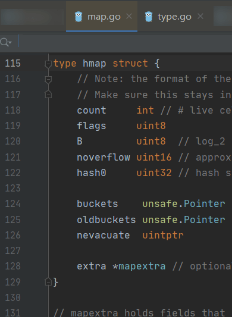
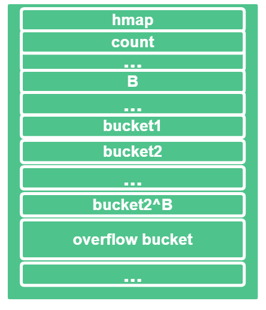
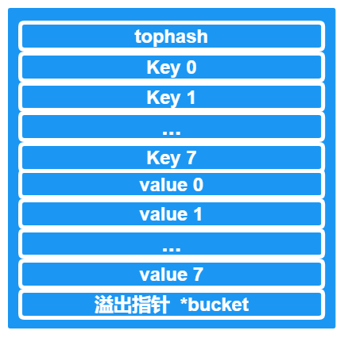
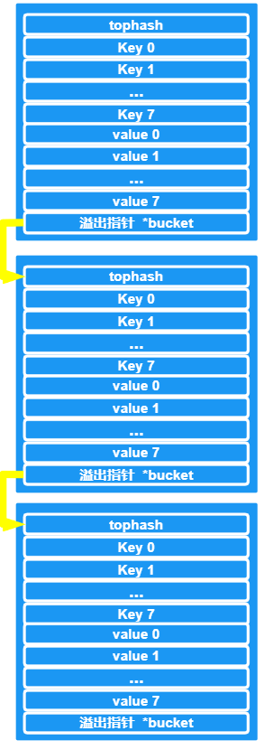
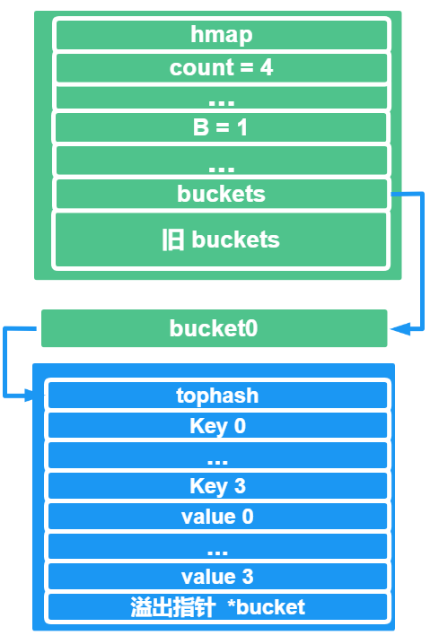
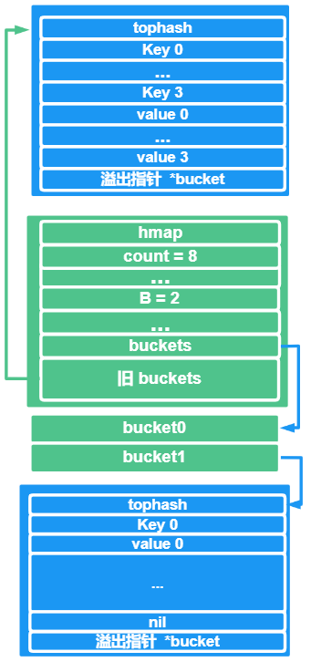
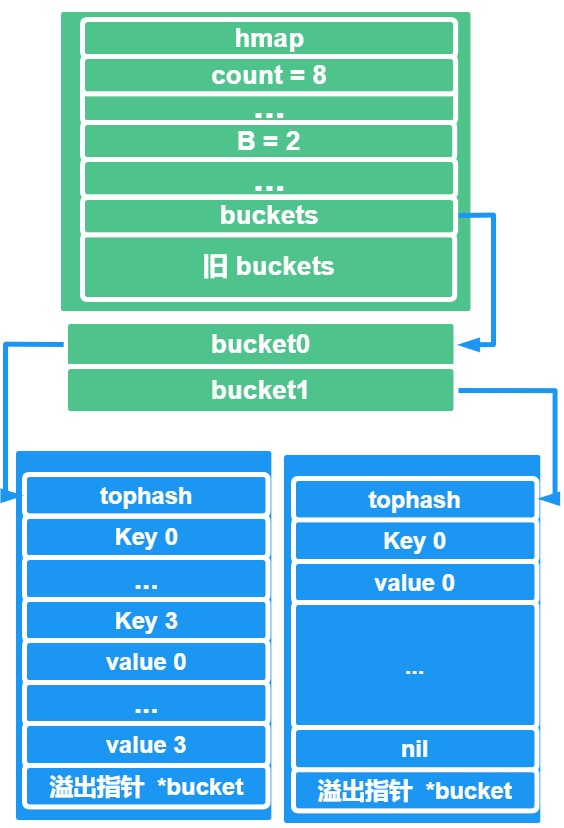

# GO 中 map 的实现原理

## map 是什么？

**是 GO 中的一种数据类型**，底层实现是 `hash 表`，看到 `hash 表` 是不是会有一点熟悉的感觉呢

我们在写 `C/C++` 的时候，里面也有 map 这种数据结构，是 `key - value` 的形式

可是在这里我们可别搞混了，GO 里面的 map 和 `C/C++` 的map 可不是同一种实现方式

- `C/C++` 的 map 底层是 红黑树实现的
- GO 的 map 底层是hash 表实现的

可是别忘了`C/C++`中还有一个数据类型是 `unordered_map`，无序map，他的底层实现是 `hash 表`，与我们GO 里面的 map 实现方式类似

## map 的数据结构是啥样的？

前面说到的 GO 中 string 实现原理，GO 中 slice 实现原理， 都会对应有他们的底层数据结构

哈，没有例外，今天说的 map 必然也有自己的数据结构， 相对来说会比前者会多一些成员，我们这就来看看吧

map 具体 的实现 源码位置是：`src/runtime/map.go`



```go
// A header for a Go map.
type hmap struct {
   // Note: the format of the hmap is also encoded in cmd/compile/internal/gc/reflect.go.
   // Make sure this stays in sync with the compiler's definition.
   count     int // # live cells == size of map.  Must be first (used by len() builtin)
   flags     uint8
   B         uint8  // log_2 of # of buckets (can hold up to loadFactor * 2^B items)
   noverflow uint16 // approximate number of overflow buckets; see incrnoverflow for details
   hash0     uint32 // hash seed

   buckets    unsafe.Pointer // array of 2^B Buckets. may be nil if count==0.
   oldbuckets unsafe.Pointer // previous bucket array of half the size, non-nil only when growing
   nevacuate  uintptr        // progress counter for evacuation (buckets less than this have been evacuated)

   extra *mapextra // optional fields
}
```

`hmap`结构中的成员我们来一个一个看看：

| 字段       | 含义                                                         |
| ---------- | ------------------------------------------------------------ |
| count      | 当前元素保存的个数                                           |
| flags      | 记录几个特殊的标志位                                         |
| B          | hash 具体的buckets数量是 2^B 个                              |
| noverflow  | 溢出桶的近似数目                                             |
| hash0      | hash种子                                                     |
| buckets    | 一个指针，指向2^B个桶对应的数组指针，若count为0  则这个指针为 nil |
| oldbuckets | 一个指针，指向扩容前的buckets数组                            |
| nevacuate  | 疏散进度计数器，也就是扩容后的进度                           |
| extra      | 可选字段，一般用于保存溢出桶链表的地址，或者是**还没有使用过**的溢出桶数组的首地址 |

通过`extra`字段， 我们看到他是`mapextra`类型的，我们看看细节

```go
// mapextra holds fields that are not present on all maps.
type mapextra struct {
   // If both key and elem do not contain pointers and are inline, then we mark bucket
   // type as containing no pointers. This avoids scanning such maps.
   // However, bmap.overflow is a pointer. In order to keep overflow buckets
   // alive, we store pointers to all overflow buckets in hmap.extra.overflow and hmap.extra.oldoverflow.
   // overflow and oldoverflow are only used if key and elem do not contain pointers.
   // overflow contains overflow buckets for hmap.buckets.
   // oldoverflow contains overflow buckets for hmap.oldbuckets.
   // The indirection allows to store a pointer to the slice in hiter.
   overflow    *[]*bmap
   oldoverflow *[]*bmap

   // nextOverflow holds a pointer to a free overflow bucket.
   nextOverflow *bmap
}
```

点进来，这里主要是要和大家一起看看这个 `bmap`的数据结构，

这个结构是，GO map 里面桶的实现结构，

```go
// A bucket for a Go map.
type bmap struct {
	// tophash generally contains the top byte of the hash value
	// for each key in this bucket. If tophash[0] < minTopHash,
	// tophash[0] is a bucket evacuation state instead.
	tophash [bucketCnt]uint8
	// Followed by bucketCnt keys and then bucketCnt elems.
	// NOTE: packing all the keys together and then all the elems together makes the
	// code a bit more complicated than alternating key/elem/key/elem/... but it allows
	// us to eliminate padding which would be needed for, e.g., map[int64]int8.
	// Followed by an overflow pointer.
}

type bmap struct {
    tophash [8]uint8 //存储哈希值的高8位
    data    byte[1]  //key value数据:key/key/key/.../value/value/value...
    overflow *bmap   //溢出bucket的地址
}
```

源码的意思是这样的：

`tophash` 一般存放的是桶内每一个key hash值字节，如果 tophash[0] < `minTopHash`， tophash[0] 是一个疏散状态

这里源码中有一个注意点：

实际上分配内存的时候，内存的前8个字节是 bmap ，后面跟着 8 个 key 、 8 个 value 和 1 个溢出指针

## 我们来看看图吧

GO 中 map 底层数据结构成员相对比 string 和 slice 多一些，不过也不是很复杂，咱们画图来瞅瞅

咱们的 `hmap`的结构是这样的，可以关注桶数组（`hmap.buckets`）



若图中的 `B = 3`的话的，那么桶数组长度 就是 **8**

上面看到**每一个 bucket ，最多可以存放 8 个`key / value`对**

如果超出了 **8** 个的话， 那么就会溢出，此时就会链接到**额外的溢出桶**

理解起来是这个样子的



严格来说，每一个桶里面只会有8 个键值对，若多余 8 的话，就会溢出，溢出的指针就会指向另外一个桶对应的 8个键值对

这里我们结合一下上面 `bmap`  的数据结构：

- tophash 是个长度为8的数组

哈希值低位相同的键存入当前bucket时，会将哈希值的高位存储在该数组中，便于后续匹配

- data里面存放的是 `key-value` 数据

存放顺序是**8个key依次排开，8个value依次排开**，**这是为啥呢？**

因为GO 里面为了字节对齐，节省空间

- overflow 指针，指向的是另外一个 桶

这里是解决了 2 个问题，第一是解决了溢出的问题，第二是解决了冲突问题

## 啥是哈希冲突？

上述我们说到 `hash 冲突`，我们来看看啥是`hash 冲突`，以及**如何解决呢**

> 关键字值不同的元素可能会映象到哈希表的同一地址上就会发生哈希冲突

简单对应到我们的上述数据结构里面来，我们可以这样理解

> 当有两个或以上的键(key)被哈希到了同一个bucket时，这些键j就发生了冲突

关于解决`hash 冲突`的方式大体有如下 4 个，网上查找的资料，咱们引用一下，梳理一波看看：

- 开放定址法

> 当冲突发生时，使用某种探查(亦称探测)技术在散列表中形成一个探查(测)序列。
>
> 沿此序列逐个单元地查找，直到找到给定 的关键字，或者碰到一个开放的地址(即该地址单元为空)为止（若要插入，在探查到开放的地址，则可将待插入的新结点存人该地址单元）。
>
> 查找时探查到开放的 地址则表明表中无待查的关键字，即查找失败。

- 再哈希法

> 同时构造多个不同的哈希函数。

- 链地址法

> 将所有哈希地址为i的元素构成一个称为同义词链的单链表，并将单链表的头指针存在哈希表的第 i 个单元中
>
> 因而查找、插入和删除主要在同义词链中进行。链地址法适用于经常进行插入和删除的情况。

- 建立公共溢出区

> 将哈希表分为基本表和溢出表两部分，凡是和基本表发生冲突的元素，一律填入溢出表。

细心的小伙伴看到这里，有没有看出来 **GO 中的map 是如何解决 hash 冲突的？**

**没错，GO 中的map 解决hash 冲突 就是使用的是 链地址法来解决键冲突**

再来一个图，咱们看看他是咋链 的，**其实咱们上述说的溢出指针就已经揭晓答案了**



如上图，每一个`bucket` 里面的溢出指针 会指向另外一个 `bucket` ，每一个`bucket` 里面存放的是 8 个 key 和 8 个 value ，bucket 里面的溢出指针又指向另外一个bucket，**用类似链表的方式将他们连接起来**

## GO 中 `map` 的基本操作有哪些？

map 的应用比较简单，感兴趣的可以在搜索引擎上查找相关资料，知道 `map` 具体实现原理之后，再去应用就会很简单了

- 有 `map` 的初始化
- `map` 的增、删、改、查

## GO 中 map 可以扩容吗？

当然可以扩容，扩容分为如下两种情况：

- 增量扩容
- 等量扩容

咱们 `map` 扩容也是有条件的，不是随随便便就能扩容的。


当一个新的元素要添加进`map`的时候，都会检查是否需要扩容，扩容的触发条件就有 2 个：

- 当负载因子 > 6.5的时候，也就是平均下来，每个`bucket`存储的键值对达到6.5个的时候，就会扩容
- 当溢出的数量 > `2^15` 的时候，也会扩容

这里说一下啥是**负载因子**呢？

有这么一个公式，来计算负载因子：

`负载因子 = 键的数量 /  bucket 数量`

**举个例子：**

若有`bucket`有8个，键值对也有8个，则这个哈希表的负载因子就是 1

哈希表也是要对负载因子进行控制的，不能让他太大，也不能太小，要在一个合适的范围内，具体的合适范围根据不同的组件有不同的值，若超过了这个合适范围，哈希表就会触发再哈希（`rehash`）

例如

- 哈希因子太小的话，这就表明空间利用率低
- 哈希因子太大的话，这就表明哈希冲突严重，存取效率比较低

注意了，在 Go 里面，负载因子达到`6.5`时会触发rehash

## 啥是增量扩容

就是当负载因子过大，也就是哈希冲突严重的时候，会做如下 **2** 个步骤

- 新建一个 bucket，新的bucket 是原 bucket 长度的 `double`
- 再将原来的 bucket 数据 搬迁到 新的 bucket 中

可是我们想一想，如果有上千万，上亿级别键值对，那么迁移起来岂不是很耗时

所以GO 还是很聪明的，他采用的逐步搬迁的方法，每次访问`map`，都会触发一次迁移

### 咱们画个图来瞅瞅

咱画一个hmap，里面有 1 个`bucket0`，这个桶的满载是 4个 `key-value`，此时的负载因子是 4



实际上是不会触发扩容的，因为GO 的默认负载因子是 **6.5**

但是我们为了演示方便，模拟一下扩容的效果

当再插入一个键值对的时候，就会触发扩容操作，扩容之后再把新插入的键值对，放到新的`bucket`中，即`bucket1`，而旧的bucket指针就会指向原来的那个bucket



最后，再做一个迁移，将旧的bucket，迁移到新的bucket上面来，删掉旧的bucket



根据上述的数据搬迁图，我们可以知道

在数据搬迁的过程中，原来的`bucket`中的键值对会存在于新的`bucket`的前面

新插入的键值对，会存在与另外一个`bucket`中，自然而然的会放到原来 bucket 的后面了


## 啥是等量扩容

等量扩容，等量这个名字感觉像是，扩充的容量和原来的容量是一一对齐的，也就是说成倍增长

**其实不然，等量扩容，其实`buckets`数量没有变化**

只是对`bucket`的键值对重新排布，整理的更加有条理，让其使用率更加的高

例如 等量扩容后，对于一些 溢出的 buckets，且里面的内容都是空的键值对，这时，就可以把这些降低效率且无效的`buckets`清理掉

这样，是提高`buckets`效率的一种有效方式

## 总结

- 分享 map 是什么
- map 的底层数据结构是啥样的
- 什么是哈希冲突，并且如何解决
- GO 的map 扩容方式，以及画图进行理解

---

> 作者：小魔童哪吒
> 链接：https://learnku.com/articles/58273#f7adf0
> 来源：learnku
> 著作权归作者所有。商业转载请联系作者获得授权，非商业转载请注明出处。
