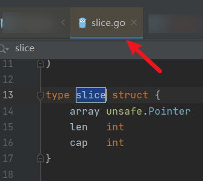
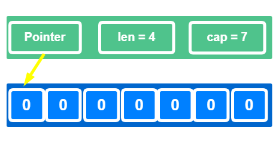
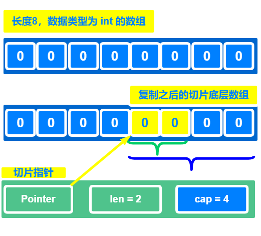
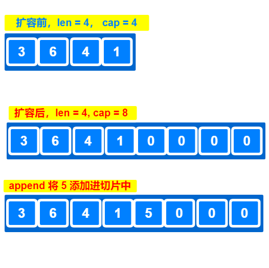

# GO 中 slice 的实现原理

## slice 是什么?

有没有觉得很熟悉，上次分享的 `string` 类型 对应的数据结构 的前两个参数 与 切片的数据结构的前两个参数是一样的


看看GO 的  `src/runtime/` 下的 `slice.go` 源码，我们可以找到 slice的数据结构



```go
type slice struct {
	array unsafe.Pointer
	len   int
	cap   int
}

// unsafe.Pointer 类型如下
// Pointer represents a pointer to an arbitrary type. There are four special operations
// available for type Pointer that are not available for other types:
//	- A pointer value of any type can be converted to a Pointer.
//	- A Pointer can be converted to a pointer value of any type.
//	- A uintptr can be converted to a Pointer.
//	- A Pointer can be converted to a uintptr.
// Pointer therefore allows a program to defeat the type system and read and write
// arbitrary memory. It should be used with extreme care.
type Pointer *ArbitraryType
```

**切片GO 的一种数据类型 ， 是对数组的一个连续片段的引用**

**切片的底层结构是一个结构体**，对应有**三个**参数


- array

是一个`unsafe.Pointer`指针，指向一个具体的底层数组

- len

指的是切片的长度

- cap

指的是切片的容量

**有没有觉得，切片和我们了解的数组好像是一样的，但是好像又不一样**

## slice 和 数组的区别是啥？


**大概有如下几个区别**

- 数组是复制传递的，而切片是引用传递的

在GO 里面，传递数组，是通过拷贝的方式

传递切片是通过引用的方式，这里说的引用，指的是 切片数据结构中`array`字段，其余字段默认是值传递

- 数组是相同类型的长度固定的序列

数组是相同类型的，一组内存空间连续的数据，他的每一个元素的数据类型都是一样的，且数组的长度一开始就确定好了，且不能做变动

- 切片是一个结构，是一个数据对象，且对象里面有 **3 个**参数

切片是引用类型，切片的长度是不固定的，可扩展的，GO 里面操作切片真的是香

当然，切片也是离不开数组的，因为他的`array`指针就是指向的一个底层数组，这个底层数组，对用户是不可见的

当使用切片的时候，数组容量不够的时候，这个底层数组会自动重新分配，**生成一个新的 切片**（**注意，这里是生成一个新的切片**）

## 如何创建 slice

创建一个新的切片有如下几种方式：

- 使用make 方法创建 新的切片
- 使用数组赋值的方式创建新的切片

### 使用make 方法创建 新的切片

新建一个 len 为 4，cap 为7 的切片：



```go
func main(){
   mySlice := make([]int,4,7)
   
   // 此处的遍历 长度是 len 的长度
   for _,v :=range mySlice{
      fmt.Printf("%v",v)
   }
}
```

上述代码运行结果为

```shell
0000
```

为什么不是 7 个 0，而是4 个

**这里要注意了：**

此处遍历遍历切片的长度是 切片的 `len` 值， 而不是切片的容量 `cap` 值

### 使用数组赋值的方式创建新的切片

- 创建一个 长度 为 8，数据类型为 `int` 的数组
- 数组的第5个元素和第6个元素复制给到新的切片



```go
func main(){

   arr := [8]int{}

   mySlice := arr[4:6]

   fmt.Println("len == ", len(mySlice))
   fmt.Println("cap == ", cap(mySlice))

   // 此处的遍历 长度是 len 的长度
   for _,v :=range mySlice{
      fmt.Printf("%v",v)
   }
}
```

上述代码运行结果为

```go
len ==  2
cap ==  4
00
```

根据代码执行情况，打印出 `00`，大家应该不会觉得奇怪


**可是为什么 cap 等于 4？**

**原因如下：**

数组的索引是从 0 开始的

上述代码 `arr[4:6]` 指的是将数组的下标为 4 开始的位置，下标为 6 的为结束位置，**这里是不包含6自己的**

根据 GO 中切片的原理，用数组复制给到切片的时候，若复制的数组元素后面还有内容的话，则后面的内容都作为切片的预留内存

即得到上述的结果，`len == 2， cap == 4`

不过这里还是要注意，切片元素对应的地址，还是这个数组元素对应的地址，使用的时候需要小心


## slice 扩容原理是什么？

我们就来模拟一下

- 新建一个 长度为 4 ，容量为 4 的切片
- 向切片中添加一个元素
- 打印最终切片的详细情况



```go
func main(){

   mySlice := make([]int,4,4)
   mySlice[0] = 3
   mySlice[1] = 6
   mySlice[2] = 7
   mySlice[3] = 8

   fmt.Printf("ptr == %p\n", &mySlice)
   fmt.Println("len == ", len(mySlice))
   fmt.Println("cap == ", cap(mySlice))

   // 此处的遍历 长度是 len 的长度
   for _,v :=range mySlice{
      fmt.Printf("%v ",v)
   }

   fmt.Println("")


   mySlice = append(mySlice,5)

   fmt.Printf("new_ptr == %p\n", &mySlice)
   fmt.Println("new_len == ", len(mySlice))
   fmt.Println("new_cap == ", cap(mySlice))

   // 此处的遍历 长度是 len 的长度
   for _,v :=range mySlice{
      fmt.Printf("%v ",v)
   }
}
```

运行上述代码，有如下效果：

```shell
ptr == 0x12004110
len ==  4
cap ==  4
3 6 7 8
new_ptr == 0x12004110
new_len ==  5
new_cap ==  8
3 6 7 8 5
```

根据案例，相信大家或多或少心里有点感觉了吧

向一个容量为 4 且长度为 4 的切片添加元素，我们发现切片的容量变成了 8


我们来看看切片扩容的规则是这样的：

- 如果原来的切片容量小于1024

那么新的切片容量就会扩展成原来的 **2 倍**

- 如果原切片容量大于等于1024

那么新的切片容量就会扩展成为原来的**1.25倍**

**我们再来梳理一下上述扩容原理的步骤是咋弄的**

上述切片扩容，大致分为如下 **2** 种情况：

- 添加的元素，加入到切片中，**若原切片容量够**

那么就直接添加元素，且切片的len ++ ，**此处的添加可不是直接赋值，可是使用 append函数的方式**，例如

```go
func main(){

	mys := make([]int,3,5)
	fmt.Println("len == ", len(mys))
	fmt.Println("cap == ", cap(mys))

	mys[0] = 1
	mys[1] = 1
	mys[2] = 1
	// mys[3] = 2   会程序崩溃
 	mys = append(mys,2)

	fmt.Println("len == ", len(mys))
	fmt.Println("cap == ", cap(mys))
	for _,v :=range mys{
		fmt.Printf("%v",v)
	}
}
```

- 若原切片容量不够，则先将切片扩容，再将原切片数据追加到新的切片中

## 简单说一下空切片和 nil 切片

平时我们在使用JSON 序列化的时候，明明切片为空

**为什么有的 JSON 输出是[] , 有的 JSON 输出是 null**

我们来看看这个例子

```go
func main(){
   // 是一个空对象
   var mys1 []int
   // 是一个对象，对象里面是一个切片，这个切片没有元素
   var mys2 = []int{}

   json1, _ := json.Marshal(mys1)
   json2, _ := json.Marshal(mys2)

   fmt.Println(string(json1))
   fmt.Println(string(json2))
}
```

运行结果为

```shell
null
[]
```

原因是这样的：

- mys1 是一个空对象
- mys2 不是一个空对象，是一个正常的对象，但是对象里面的为空


## 总结

- 分享了切片是什么
- 切片和数组的区别
- 切片的数据结构
- 切片的扩容原理
- 空切片 和 nil 切片的区别

---

> 作者：小魔童哪吒
> 链接：https://learnku.com/articles/58273#f7adf0
> 来源：learnku
> 著作权归作者所有。商业转载请联系作者获得授权，非商业转载请注明出处。
