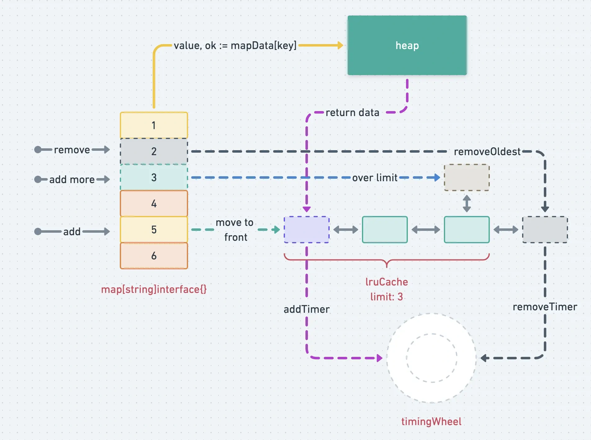

# 进程内缓存助你提高并发能力

## 前言

缓存，设计的初衷是为了减少繁重的IO操作，增加系统并发能力。不管是 `CPU多级缓存`，`page cache`，还是我们业务中熟悉的 `redis` 缓存，本质都是将有限的热点数据存储在一个存取更快的存储介质中。

计算机本身的缓存设计就是 CPU 采取多级缓存。那对我们服务来说，我们是不是也可以采用这种多级缓存的方式来组织我们的缓存数据。同时 `redis` 的存取都会经过网络IO，那我们能不能把热点数据直接存在本进程内，由进程自己缓存一份最近最热的这批数据呢？

这就引出了我们今天探讨的：`local cache`，本地缓存，也叫进程缓存。

本文带你一起探讨下 `go-zero` 中进程缓存的设计。Let’s go!

## 快速入门

作为一个进程存储设计，当然是 `crud` 都有的：

1. 我们先初始化 `local cache`

```go
// 先初始化 local cache
cache, err = collection.NewCache(time.Minute, collection.WithLimit(10))
if err != nil {
  log.Fatal(err)
}
```

其中参数的含义：

- `expire`：key统一的过期时间
- `CacheOption`：cache设置。比如key的上限设置等

2. 基础操作缓存

```go
// 1. add/update 增加/修改都是该API
cache.Set("first", "first element")

// 2. get 获取key下的value
value, ok := cache.Get("first")

// 3. del 删除一个key
cache.Del("first")
```

- `Set(key, value)` 设置缓存
- `value, ok := Get(key)` 读取缓存
- `Del(key)` 删除缓存

3. 高级操作

```go
cache.Take("first", func() (interface{}, error) {
  // 模拟逻辑写入local cache
  time.Sleep(time.Millisecond * 100)
  return "first element", nil
})
```

前面的  `Set(key, value)` 是单纯将  `<key, value>` 加入缓存；`Take(key, setFunc)` 则是在 key 对于的 value 不存在时，执行传入的 `fetch` 方法，将具体读取逻辑交给开发者实现，并自动将结果放到缓存里。

到这里核心使用代码基本就讲完了，其实看起来还是挺简单的。也可以到 https://github.com/tal-tech/go-zero/blob/master/core/collection/cache_test.go 去看 test 中的使用。

## 解决方案



首先缓存实质是一个存储有限热点数据的介质，面临以下的这些问题：

1. 有限容量
2. 热点数据统计
3. 多线程存取

下面来说说这3个方面我们的设计实践。

### 有限容量

有限就意味着满了要淘汰，这个就涉及到淘汰策略。`cache` 中使用的是：`LRU`（最近最少使用）。

***那淘汰怎么发生呢？*** 有几个选择：

1. 开一个定时器，不断循环所有key，等到了预设过期时间，执行回调函数（这里是删除map中过的key）
2. 惰性删除。访问时判断该键是否被删除。缺点是：如果未访问的话，会加重空间浪费。

而 `cache` 中采取的是第一种 **主动删除**。但是，主动删除中遇到最大的问题是：

**不断循环，空消耗CPU资源，即使在额外的协程中这么做，也是没有必要的。**

`cache` 中采取的是时间轮记录额外过期通知，等过期 `channel` 中有通知时，然后触发删除回调。

> 有关 *时间轮* 更多的设计文章：https://go-zero.dev/cn/timing-wheel.html

### 热点数据统计

对于缓存来说，我们需要知道这个缓存在使用额外空间和代码的情况下是否有价值，以及我们想知道需不需要进一步优化过期时间或者缓存大小，所有这些我们就很依赖统计能力了， `go-zero` 中 `sqlc` 和 `mongoc` 也同样提供了统计能力。所以我们在 `cache` 中也加入的缓存，为开发者提供本地缓存监控的特性，在接入 `ELK` 时开发者可以更直观的监测到缓存的分布情况。

而设计其实也很简单，就是：**Get() 命中，就在统计 count 上加1即可**。

```go
func (c *Cache) Get(key string) (interface{}, bool) {
  value, ok := c.doGet(key)
  if ok {
    // 命中hit+1
    c.stats.IncrementHit()
  } else {
    // 未命中miss+1
    c.stats.IncrementMiss()
  }

  return value, ok
}
```

### 多线程存取

当多个协程并发存取的时候，对于缓存来说，涉及的问题以下几个：

- 写-写冲突
- `LRU` 中元素的移动过程冲突
- 并发执行写入缓存时，造成流量冲击或者无效流量

这种情况下，写冲突好解决，最简单的方法就是 **加锁** ：

```go
// Set(key, value)
func (c *Cache) Set(key string, value interface{}) {
  // 加锁，然后将 <key, value> 作为键值对写入 cache 中的 map
  c.lock.Lock()
  _, ok := c.data[key]
  c.data[key] = value
  // lru add key
  c.lruCache.add(key)
  c.lock.Unlock()
  ...
}

// 还有一个在操作 LRU 的地方时：Get()
func (c *Cache) doGet(key string) (interface{}, bool) {
  c.lock.Lock()
  defer c.lock.Unlock()
  // 当key存在时，则调整 LRU item 中的位置，这个过程也是加锁的
  value, ok := c.data[key]
  if ok {
    c.lruCache.add(key)
  }

  return value, ok
}
```

而并发执行写入逻辑，这个逻辑主要是开发者自己传入的。而这个过程：

```go
func (c *Cache) Take(key string, fetch func() (interface{}, error)) (interface{}, error) {
  // 1. 先获取 doGet() 中的值
  if val, ok := c.doGet(key); ok {
    c.stats.IncrementHit()
    return val, nil
  }

  var fresh bool
  // 2. 多协程中通过 sharedCalls 去获取，一个协程获取多个协程共享结果
  val, err := c.barrier.Do(key, func() (interface{}, error) {
    // double check，防止多次读取
    if val, ok := c.doGet(key); ok {
      return val, nil
    }
    ...
    // 重点是执行了传入的缓存设置函数
    val, err := fetch()
    ...
    c.Set(key, val)
  })
  if err != nil {
    return nil, err
  }
  ...
  return val, nil
}
```

而 `sharedCalls` 通过共享返回结果，节省了多次执行函数，减少了协程竞争。

## 总结

本篇文章讲解了本地缓存设计实践。从使用到设计思路，你也可以根据你的业务动态修改 *缓存的过期策略*，*加入你想要的统计指标*，实现自己的本地缓存。

> 作者：kevwan
> 链接：https://learnku.com/articles/57360
> 来源：learnku
> 著作权归作者所有。商业转载请联系作者获得授权，非商业转载请注明出处。
