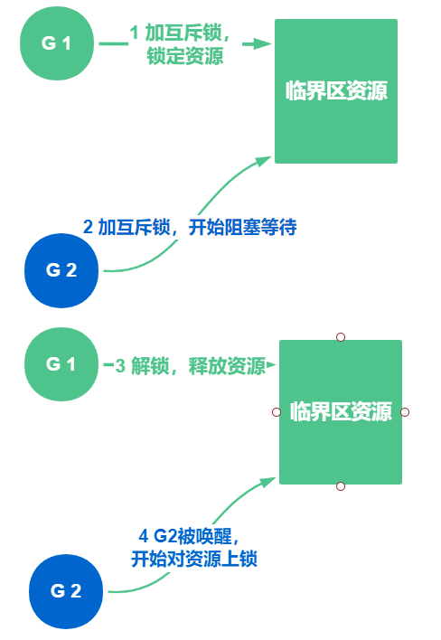
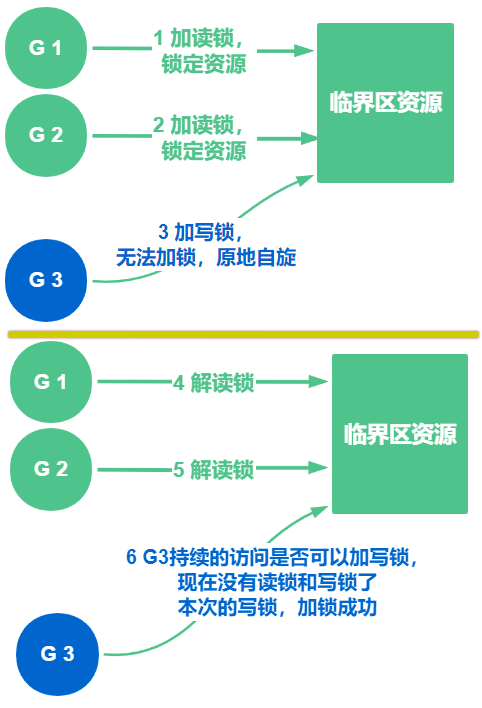
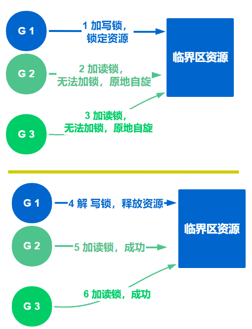

# GO的锁和原子操作分享

上次我们说到协程，我们再来回顾一下：

- 协程类似线程，是一种更为轻量级的调度单位
- 线程是系统级实现的，常见的调度方法是时间片轮转法
- 协程是应用软件级实现，原理与线程类似
- 协程的调度基于 **GPM 模型**实现

要是对协程的使用感兴趣的话，可以看看这篇文章简单了解一下[瞅一眼就会使用GO的并发编程分享](https://juejin.cn/post/6972547346039046157)

今天我们来聊聊GO里面的锁

## 锁是什么？

**锁 是用于解决隔离性的一种机制**

某个协程（线程）在访问某个资源时先锁住，防止其它协程的访问，等访问完毕解锁后其他协程再来加锁进行访问

在我们生活中，我们应该不会陌生，锁是这样的

> 本意是指置于可启闭的器物上，以钥匙或暗码开启，引申义是用锁锁住、封闭

**生活中用到的锁**

上锁基本是为了防止外人进来、防止自己财物被盗

**编程语言中的锁**

锁的种类更是多种多样，每种锁的加锁开销以及应用场景也不尽相同


## 锁是用来做什么的？

用来控制各个协程的同步，防止资源竞争导致错乱问题

在高并发的场景下，如果选对了合适的锁，则会大大提高系统的性能，否则性能会降低。

那么知道各种锁的开销，以及应用场景很有必要

**GO中的锁有哪些？**

- 互斥锁
- 读写锁

我们在编码中会存在多个 **goroutine 协程**同时操作一个资源（临界区），这种情况会发生竞态问题（**数据竞态**）

**举一个生活中的例子**

生活中最明显的例子就是，大家抢着上厕所，资源有限，只能一个一个的用

**举一个编码中的例子**

```go
package main

import (
	"fmt"
	"sync"
)

// 全局变量
var num int64
var wg sync.WaitGroup

func add() {
	for i := 0; i < 10000000; i++ {
		num = num + 1
	}
	// 协程退出， 记录 -1
	wg.Done()
}
func main() {
	// 启动2个协程，记录 2
	wg.Add(2)

	go add()
	go add()

	// 等待子协程退出
	wg.Wait()
	fmt.Println(num)
}
```

按照上述代码，我们的输出结果应该是 `20000000`，每一个协程计算 **10000000** 次，可是实际结果却是

```go
10378923
```

每一次计算的结果还不一样，出现这个问题的原因就是上述提到的资源竞争

两个 goroutine 协程在访问和修改num变量，会存在2个协程同时对num+1 ， 最终num 总共只加了 1 ，而不是 2

这就导致最后的结果与期待的不符，那么我们如何解决呢？


我们当然是用锁控制同步了，保证各自协程在操作临界区资源的时候，先确实是否拿到锁，只有拿到锁了才能进行对临界区资源的修改

先来看看互斥锁

## 互斥锁



互斥锁的简单理解就像上述我们讲到上厕所的案例一样，同一时间点，只能有一个人在使用其他人只能排队等待

在编程中，引入了对象互斥锁的概念，来保证共享数据操作的完整性

每个对象都对应于一个可称为`互斥锁`的标记，这个标记用来保证在任一时刻，只能有一个协程访问该对象。

**应用场景**

写大于读操作的

它代表的资源就是一个，不管是读者还是写者，只要谁拥有了它，那么其他人就只有等待解锁后

我们来使用互斥锁解决上述的问题

## 互斥锁 - 解决问题

互斥锁是一种常用的控制共享资源访问的方法，它能够保证同时只有一个 goroutine 协程可以访问共享资源

Go 中使用到如下 1个知识点来解决

- **sync包** 的 **Mutex类型** 来实现互斥锁

```go
package main

import (
   "fmt"
   "sync"
)

// 全局变量
var num int64
var wg sync.WaitGroup
var lock sync.Mutex

func add() {
   for i := 0; i < 10000000; i++ {
      // 访问资源前  加锁
      lock.Lock()
      num = num + 1
      // 访问资源后  解锁
      lock.Unlock()
   }
   // 协程退出， 记录 -1
   wg.Done()
}
func main() {
   // 启动2个协程，记录 2
   wg.Add(2)

   go add()
   go add()

   // 等待子协程退出
   wg.Wait()
   fmt.Println(num)
}
```

执行上述代码，我们能看到，输出的结果与我们预期的一致

```go
20000000
```

使用互斥锁能够保证同一时间有且只有一个goroutine 协程进入临界区，其他的goroutine则在等待锁

当互斥锁释放后，等待的 goroutine 协程才可以获取锁进入临界区

**如何知道哪一个协程是先被唤醒呢？**

可是，多个goroutine  协程同时等待一个锁时，如何知道哪一个协程是先被唤醒呢？

**互斥锁这里的唤醒的策略是随机的**，并不知道到底是先唤醒谁

## 读写锁

为什么有了互斥锁 ，还要读写锁呢？

很明显就是互斥锁不能满足所有的应用场景，就催生出了读写锁，我们细细道来


互斥锁是完全互斥的，不管协程是读临界区资源还是写临界区资源，都必须要拿到锁，否则就无法操作（这个限制太死了对吗？

可是在我们实际的应用场景下是**读多写少**

若我们并发的去读取一个资源，且不对资源做任何修改的时候如果也要加锁才能读取数据，是不是就很没有必要呢

这种场景下读写锁就发挥作用了，他就相对灵活了，也很好的解决了读多写少的场景问题

**读写锁的种类**

- 读锁
- 写锁



当一个goroutine 协程获取读锁之后，其他的 goroutine 协程如果是获取读锁会继续获得锁

可如果是获取写锁就必须等待

当一个 goroutine 协程获取写锁之后，其他的goroutine 协程无论是获取读锁还是写锁都会等待

## 我们先来写一个读写锁的DEMO

Go 中使用到如下 1个知识点来解决

- **sync包** 的 **RWMutex类型** 来实现读写锁

```go
package main

import (
   "fmt"
   "sync"
   "time"
)

var (
   num    int64
   wg     sync.WaitGroup
   //lock   sync.Mutex
   rwlock sync.RWMutex
)

func write() {
   // 加互斥锁
   // lock.Lock()

   // 加写锁
   rwlock.Lock()

   num = num + 1
   // 模拟真实写数据消耗的时间
   time.Sleep(10 * time.Millisecond)

   // 解写锁
   rwlock.Unlock()

   // 解互斥锁
   // lock.Unlock()

   // 退出协程前 记录 -1
   wg.Done()
}

func read() {
   // 加互斥锁
   // lock.Lock()

   // 加读锁
   rwlock.RLock()

   // 模拟真实读取数据消耗的时间
   time.Sleep(time.Millisecond)

   // 解读锁
   rwlock.RUnlock()

   // 解互斥锁
   // lock.Unlock()

   // 退出协程前 记录 -1
   wg.Done()
}

func main() {
   // 用于计算时间 消耗
   start := time.Now()

   // 开5个协程用作 写
   for i := 0; i < 5; i++ {
      wg.Add(1)
      go write()
   }

   // 开500 个协程，用作读
   for i := 0; i < 1000; i++ {
      wg.Add(1)
      go read()
   }

   // 等待子协程退出
   wg.Wait()
   end := time.Now()

   // 打印程序消耗的时间
   fmt.Println(end.Sub(start))
}
```

我们开5个协程用于写，开1000个协程用于读，使用读写锁加锁，结果耗时 `54.4871ms` 如下

```go
54.4871ms
```

如果我们将上述代码修改成加 互斥锁，运行之后的结果是 `1.7750029s`  如下

```go
1.7750029s
```

是不是结果相差很大呢，对于不同的场景应用不同的锁，对于我们的程序性能影响也是很大，当然上述结果，若读协程，和写协程的个数差距越大，结果就会越悬殊


**我们总结一下这一小块的逻辑：**



- 写者是排他性的，一个读写锁同时只能有一个写者或多个读者
- 不能同时既有读者又有写者
- 如果读写锁当前没有读者，也没有写者，那么写者可以立刻获得读写锁，否则它必须自旋在那里，直到没有任何写者或读者。
- 如果读写锁没有写者，那么读者可以立即获得该读写锁，否则读者必须自旋在那里，直到写者释放该读写锁。

上述提了自旋锁，我们来简单解释一下，**什么是自旋锁**

> 自旋锁是专为防止多处理器并发而引入的一种锁，它在内核中大量应用于中断处理等部分（对于单处理器来说，防止中断处理中的并发可简单采用关闭中断的方式，即在标志寄存器中关闭/打开中断标志位，不需要自旋锁）。

简单来说，在并发过程中，若其中一个协程拿不到锁，他会不停的去尝试拿锁，不停的去看能不能拿，而不是阻塞睡眠

## 自旋锁和互斥锁的区别

- 互斥锁

当拿不到锁的时候，会阻塞等待，会睡眠，等待锁释放后被唤醒

- 自旋锁

当拿不到锁的时候，会在原地不停的看能不能拿到锁，所以叫做自旋，他不会阻塞，不会睡眠

## 如何选择锁？


**对于 C/C++ 而言**

- 若加锁后的业务操作消耗，大于互斥锁阻塞后切换上下文的消耗 ，那么就选择互斥锁
- 若加锁后的业务操作消耗，小于互斥锁阻塞后切换上下文的消耗，那么选择自旋锁

**对于 GO 而言**

- 若写的频次大大的多余读的频次，那么选择互斥锁
- 若读的频次大大的多余写的频次，那么选择读写锁

我们都是对自身要求比较高的同学，**那么有没有比锁还好用的东西呢**？

自然是有的，我们来看看原子操作

## 啥是原子操作

> "原子操作(atomic operation)是不需要synchronized"，这是多线程编程的老生常谈了。所谓原子操作是指不会被线程调度机制打断的操作
>
> 这种操作一旦开始，就一直运行到结束，中间不会有任何 context switch （切换到另一个线程）。

**原子操作的特性：**

- 原子操作是不可分割的，在执行完毕之前不会被任何其它任务或事件中断

上述我们的加锁案例，咱们编码中的加锁操作会涉及内核态的上下文切换会比较耗时、代价比较高

针对**基本的数据类型**我们还可以使用原子操作来保证**并发安全**

因为原子操作是Go语言提供的方法它在**用户态**就可以完成，因此性能比加锁操作更好

不用我们自己写汇编，这里 GO 也提供了原子操作的包，供我们一起来使用 `sync/atomic`


我们对上述的案例做一个延伸

```go
package main

import (
	"fmt"
	"sync"
	"sync/atomic"
	"time"
)

var num int64
var l sync.Mutex
var wg sync.WaitGroup

// 普通版加函数
func add() {
	num = num + 1
	wg.Done()
}

// 互斥锁版加函数
func mutexAdd() {
	l.Lock()
	num = num + 1
	l.Unlock()
	wg.Done()
}

// 原子操作版加函数
func atomicAdd() {
	atomic.AddInt64(&num, 1)
	wg.Done()
}

func main() {
	// 目的是 记录程序消耗时间
	start := time.Now()
	for i := 0; i < 20000; i++ {

		wg.Add(1)

		// go add()       // 无锁的  add函数 不是并发安全的
		// go mutexAdd()  // 互斥锁的 add函数 是并发安全的，因为拿不到互斥锁会阻塞，所以加锁性能开销大

		go atomicAdd()    // 原子操作的 add函数 是并发安全，性能优于加锁的
	}

	// 等待子协程 退出
	wg.Wait()

	end := time.Now()
	fmt.Println(num)
	// 打印程序消耗时间
	fmt.Println(end.Sub(start))
}
```

我们使用上述 demo 代码，模拟了3种情况下，**程序的耗时以及计算结果**对比

- 不加锁

无锁的  add函数 不是并发安全的

```go
19495
11.9474ms
```

- 加互斥锁

互斥锁的 add函数 是并发安全的，因为拿不到互斥锁会阻塞，所以加锁性能开销大

```go
20000
14.9586ms
```

- 使用原子操作

原子操作的 add函数 是并发安全，性能优于加锁的

```go
20000
9.9726ms
```


## 总结

- 分享了锁是什么，用来做什么
- 分享了互斥锁，读写锁，以及其区别和应用场景
- 分享了原子操作
- 大家感兴趣可以去看看锁的实现，里面也是有使用原子操作

---

> 作者：小魔童哪吒
> 链接：https://learnku.com/articles/58076
> 来源：learnku
> 著作权归作者所有。商业转载请联系作者获得授权，非商业转载请注明出处。
